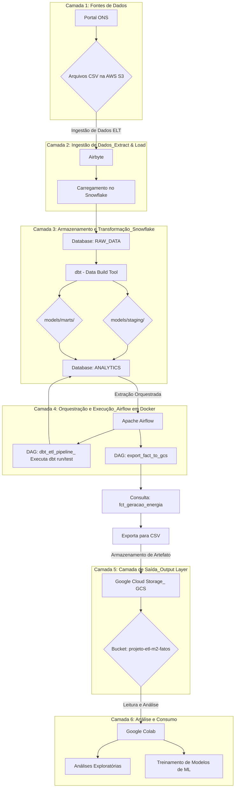

## Diagrama de Fluxo (Flowchart) - Arquitetura da Solução em Nuvem para o Projeto de Energia

```mermaid
graph TD
    subgraph Camada 1: Fontes de Dados
        A[Portal ONS] --> B{Arquivos CSV na AWS S3}
    end

    B -->|Ingestão de Dados  ELT| C[Airbyte]

    subgraph Camada 2:        Ingestão de Dados_Extract & Load
        C --> D[ Carregamento no Snowflake]
    end

    subgraph Camada 3: Armazenamento e Transformação_Snowflake
        D --> E[Database: RAW_DATA]
        E --> F[dbt - Data Build Tool]
        F --> G{models/staging/}
        F --> H{models/marts/}
        G --> I[Database: ANALYTICS]
        H --> I
    end

    I -->|Extração Orquestrada| J[Apache Airflow]

    subgraph Camada 4: Orquestração e Execução_Airflow em Docker
        J --> K[DAG: dbt_etl_pipeline_ Executa dbt run/test]
        J --> L[DAG: export_fact_to_gcs]
    end

    K --> I
    L --> M[Consulta: fct_geracao_energia]
    M --> N[Exporta para CSV]

    N -->|Armazenamento de Artefato| O[Google Cloud Storage_ GCS]

    subgraph Camada 5: Camada de Saída_Output Layer
        O --> P{Bucket: projeto-etl-m2-fatos}
    end

    P -->|Leitura e Análise| Q[Google Colab]

    subgraph Camada 6: Análise e Consumo
        Q --> R[Análises Exploratórias]
        Q --> S[Treinamento de Modelos de ML]
    end
```
